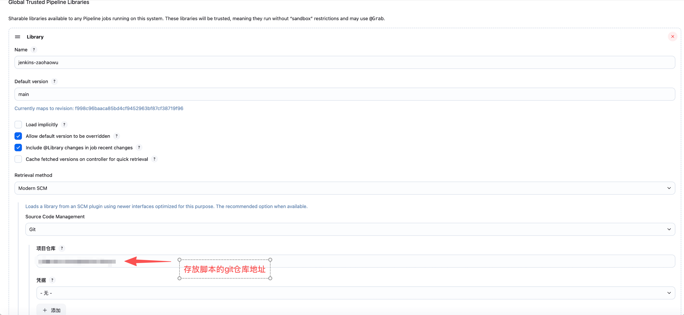
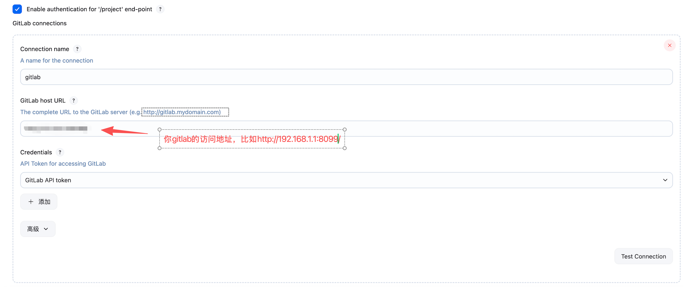
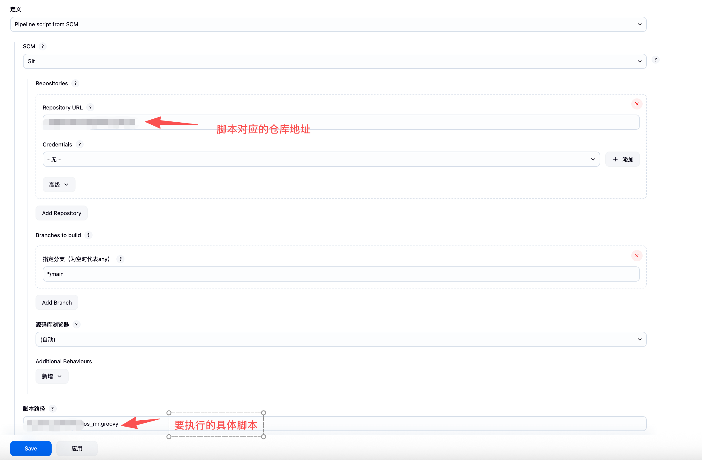
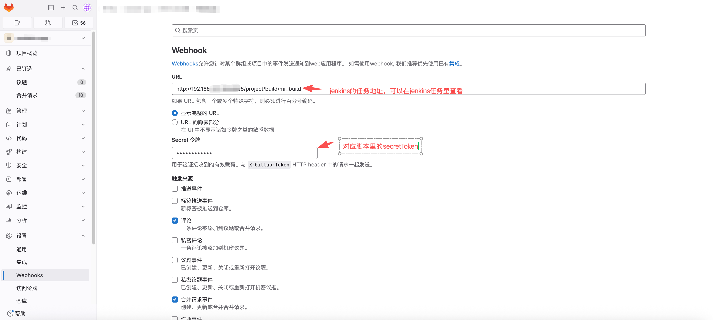

# jenkins-flutter-ci

基于 Jenkins Declarative Pipeline 的 Flutter App 持续构建脚本，配合 GitLab Merge Request 使用。

功能：

- gitlab的MR提交会自动触发版本编译（如果需要手动触发则直接在MR提交里手动回复：/retry）-- 用于日常的功能开发测试
- 可以针对某个固定分支进行版本编译 -- 用于正式版本发布
- 编译后的产物（apk，ipa）可以存放到服务器固定的位置进行存储
- Android 产物上传蒲公英
- 编译结果自动同步到飞书群和对应的MR评论区（MR地址，提交者，分支，提交记录，版本号，蒲公英地址，远程存储路径等）

## 目录结构

```
mr_build_android.groovy        Android 任务入口（Jenkins Script Path 指向它）
mr_build_ios.groovy            iOS 任务入口
pipelines/
  mr_build_android.groovy      Android 流水线正文（含项目配置 environment 块）
  mr_build_ios.groovy          iOS 流水线正文
vars/                          Jenkins 共享库（Global Pipeline Library）
  gitlabMrCheckout.groovy      检出目标分支并合并 MR 源分支，设置 MR_* / COMMIT_MESSAGES 等 env
  getVersion.groovy            读取版本号文件首行（本地路径或 user@host:/path）
  updatePubspecVersion.groovy  写回 pubspec.yaml 的 version 行
  copyArtifactToRemote.groovy  产物拷贝（自动判断本机 / 远程，5 分钟超时）
  pgyerUpload.groovy           蒲公英上传
  postGitLabMRComment.groovy   GitLab MR 评论回写
  sendFeishuCard.groovy        飞书卡片消息发送（Webhook 从凭据读取）
  notifyPipelineCompileFailure.groovy  流水线脚本编译失败时的兜底通知
  readTrustedPipeline.groovy   入口读取 pipelines/ 下正文
verify-pgyer-upload.sh         在构建机上独立验证蒲公英上传链路的脚本
```

入口文件与流水线正文分开的原因：Jenkinsfile 本身编译失败时 Declarative 的 `post { failure }` 不会执行，入口先用 `evaluate(readTrusted(...))` 加载正文，catch 后仍能发飞书。

## 环境要求

构建机（Jenkins agent）：

- Flutter SDK；iOS 任务还需要 macOS + Xcode 命令行工具；
- `git`、`curl`、`bash`、`awk`；
- 能免密 `ssh` 到 GitLab 拉取业务仓库（或改用 Jenkins SSH 凭据，见「创建凭据」）；
- 能免密 `ssh` / `scp` 到产物服务器（或构建机本身就是产物服务器）；
- 若使用 `user@host:/path` 形式的版本号文件，需能免密 ssh 到该主机；
- `verify-pgyer-upload.sh` 需要 `python3`。

Jenkins 插件：

- Pipeline、Git、Credentials；
- GitLab Plugin（提供 `gitlab(...)` 触发器、`addGitLabMRComment` 步骤与 GitLab API token 凭据类型）。

## 安装步骤

### 1. 配置共享库

Manage Jenkins → System → Global Trusted Pipeline Libraries → Add：

| 项 | 值 |
| --- | --- |
| Name | `jenkins-flutter-ci`，须与四个 groovy 文件顶部的 `@Library('jenkins-flutter-ci')` 一致；改名时同步改脚本 |
| Default version | `main`，保存后下方会显示当前映射到的 commit |
| Load implicitly | 不勾选，脚本里显式 `@Library` 加载 |
| Allow default version to be overridden | 勾选 |
| Include @Library changes in job recent changes | 勾选，共享库的改动会出现在任务的变更记录里 |
| Cache fetched versions on controller for quick retrieval | 不勾选 |
| Retrieval method | Modern SCM |
| Source Code Management | Git |
| 项目仓库 | 本仓库地址 |
| 凭据 | 公开仓库选「无」；私有仓库选能拉取本仓库的凭据 |



共享库与流水线脚本放在同一个仓库即可。放在 Global **Trusted** Pipeline Libraries 下，库代码不受沙箱限制，无需逐条做脚本审批。

### 2. 配置 GitLab 连接

Manage Jenkins → System → GitLab：

| 项 | 值 |
| --- | --- |
| Enable authentication for '/project' end-point | 勾选，Webhook 请求必须携带与任务 `secretToken` 一致的 Secret token |
| Connection name | `gitlab` |
| GitLab host URL | GitLab 地址，填 Jenkins 能直接访问的内网地址，如 `http://192.168.1.1:8099/` |
| Credentials | 类型为 GitLab API token 的凭据，见下一步 |



填完点 Test Connection 确认返回 Success。流水线里的 `addGitLabMRComment` 不指定连接名，使用任务 General 里「GitLab Connection」选中的连接；只配置了一个连接时默认就是它。

### 3. 创建凭据

| 凭据 ID | 类型 | 内容 |
| --- | --- | --- |
| `gitlab-api-token` | GitLab API token | GitLab 个人访问令牌，需 `api` 权限，供上一步的 GitLab 连接回写 MR 评论 |
| `feishu-webhook` | Secret text | 飞书群机器人完整 Webhook 地址 |
| `pgyer-api-key` | Secret text | 蒲公英 API Key（仅 Android 任务需要） |

凭据 ID 可以改，改后同步修改流水线正文 `environment` 块里对应的 `*_CREDENTIALS_ID`，以及入口文件的 `webhookCredentialsId`。GitLab API token 类型的凭据由 GitLab Plugin 提供，需先装好插件再创建。

拉取业务仓库不需要单独的凭据：构建机以 `git` 用户免密 ssh 到 GitLab 即可，先在构建机上执行 `ssh -T git@<gitlab-host>` 确认能连通并写入 known_hosts。若不想在构建机上放私钥，也可以另建一个 SSH Username with private key 类型的凭据（Username 填 `git`，私钥对应的公钥登记为 GitLab Deploy Key），并把 `GIT_CREDENTIALS_ID` 设为该凭据 ID。

### 4. 修改项目配置

打开 `pipelines/mr_build_android.groovy` 与 `pipelines/mr_build_ios.groovy`，按注释修改顶部 `environment` 块：

| 变量 | 说明 |
| --- | --- |
| `REPO_URL` | 业务仓库 SSH 地址（Webhook 触发时以 Webhook 注入的地址为准） |
| `GIT_CREDENTIALS_ID` | 构建机已免密 ssh 到 GitLab 时设为 `''`；否则填 SSH 凭据 ID |
| `FEISHU_WEBHOOK_CREDENTIALS_ID` / `PGYER_CREDENTIALS_ID` | 上一步的凭据 ID |
| `ARTIFACT_HOST` | 产物服务器 `user@host`；构建机本身就是产物服务器时自动改为本地 cp |
| `ARTIFACT_ROOT_DIR` | 产物（apk和ipa）根目录，产物存放在 `<根目录>/mrBuild/<日期>/android|ios/...` |
| `FLUTTER_SDK_DIR` | Flutter SDK 目录，为空则用 PATH 里的 flutter |
| `ANDROID_KEY_PROPERTIES` | Android 签名配置文件，编译前拷贝到工程 `android/`，为空则不拷贝 |
| `IOS_EXPORT_OPTIONS_DIR` | iOS 导出配置目录，需含 `testFlight/ExportOptions.plist` 与 `appStore/ExportOptions.plist`（可以直接从xcode里导出） |
| `GITLAB_INTERNAL_URL` / `GITLAB_PUBLIC_URL` | GitLab 内网地址到公网地址的替换，用于通知里的 MR 链接；不需要则留空 |

`triggers { gitlab(...) }` 里的 `secretToken` 与 `targetBranchRegex` 也按需修改，Declarative 的 triggers 块无法引用 environment。

### 5. 创建 Jenkins 任务

新建 Pipeline 任务：

- General 里 GitLab Connection 选第 2 步创建的 `gitlab`；
- Pipeline 定义选 Pipeline script from SCM，SCM 选 Git，Repository URL 填本仓库，公开仓库 Credentials 选「无」，Branches to build 填 `*/main`，脚本路径填 `mr_build_android.groovy` 或 `mr_build_ios.groovy`；
- 勾选「参数化构建过程」，按下表添加参数（脚本内不声明 `parameters {}`，默认值在界面维护）；
- Build Triggers 勾选 GitLab 触发，保存后手动跑一次以同步触发器配置。



### 6. 配置 GitLab Webhook

业务仓库 Settings → Webhooks：

- URL：`http://<jenkins>/project/<任务名>`，任务在文件夹里时带上文件夹路径，如 `/project/build/mr_build`；
- Secret token：与流水线 `secretToken` 一致，第 2 步开启了 `/project` 端点鉴权，不一致会返回 403；
- 触发来源勾选「合并请求事件」与「评论」；流水线 `triggerOnPush` 为 `true` 时还需勾选「推送事件」。



## 任务参数

| 参数 | 平台 | 说明 |
| --- | --- | --- |
| `version_pre` | 双端 | 必填。完整版本号 `X.Y.Z` 直接使用（正式发版用）；前缀 `X.Y.` 或 `X.Y` 与版本号文件读出的数字拼成 `X.Y.Z`（平时开发过程中使用） |
| `version_file_path` | 双端 | 必填。版本号文件路径，首行为非负整数；支持本地路径或 `user@host:/path`（为了方便区分不同的MR包，所以会有一个打包时版本自增的逻辑，这个文件存储的就是每次打包的版本号，每次执行后加1） |
| `env` | 双端 | `prod` / `pre` / `dev`，选择 `config/<env>.json` 作为 `--dart-define-from-file`；缺省 `prod`（这个其实是我们内部切换不同环境的一些配置，可以根据项目的实际内容进行调整） |
| `is_force_build` | 双端 | `true` 时即使与上次成功构建为同一提交也完整构建 |
| `BRANCH` | Android | 无 Webhook 时的检出分支，缺省 `main` |
| `official_version` | Android | 应用商店发版时使用，为true时打包会打两个apk，一个是release的，一个是debug的。debug的有一些应用自己的后门，方便验证，也可以直接通过charles抓包。release为实际提交要应用商店的版本|
| `export_method` | iOS | `flutter build ipa --export-method`，缺省 `development` |
| `distribute_type` | iOS | 可以选择`testFlight` 和 `app` 两个值。选择`testFlight`时版本会上传到testflight进行测试，但是不能提交应用商店，选择`app`时可以同时提交到应用商店，其它值跳过 |
| `ipaFile` | iOS | 指定 IPA 路径；为空则取 `build/ios/ipa/` 下最新的 |

手动触发相关参数（由 `gitlabMrCheckout` 读取）：

| 参数 | 说明 |
| --- | --- |
| `repo_url` | 覆盖 `REPO_URL` |
| `source_branch` + `target_branch` | 按分支做一次类 MR 编译 |
| `source_commit` + `target_commit` | 按 commit 编译 |

Jenkins 会缓存上一次构建的参数值。把界面默认值改为 `false` 后，Webhook 触发的构建仍可能沿用旧值，需要手动 Build with Parameters 跑一次覆盖。

## 业务工程约定

- 根目录有 `pubspec.yaml`，`version:` 行由流水线改写为 `X.Y.Z+<buildNumber>`，`buildNumber = major*100000 + minor*1000 + patch`；
- 存在 `config/prod.json`、`config/pre.json`、`config/dev.json` 供 `--dart-define-from-file` 使用；
- Android 工程读取 `android/key.properties` 作为签名配置。

## 蒲公英上传链路排查

```bash
export PGYER_API_KEY=xxxx
./verify-pgyer-upload.sh --token-only       # 只验证鉴权与网关连通
./verify-pgyer-upload.sh app.apk            # 完整三步式上传
./verify-pgyer-upload.sh --help             # 全部选项
```

说明：`pgyerUpload` 返回的 `versionUrl` 含蒲公英 `_api_key`，Android 流水线默认把它回写到 MR 评论。不希望暴露时把 `postGitLabMRComment` 的 `pgyerUrl` 改为 `env.PGYER_URL`。

## 说明

本仓库是由 AI 在我实际使用的仓库基础上修改而成，去掉了一些定制化和隐私的内容，并且没有实际执行过。大家使用的时候可以根据自己的需求再重新调整。

## License

MIT
